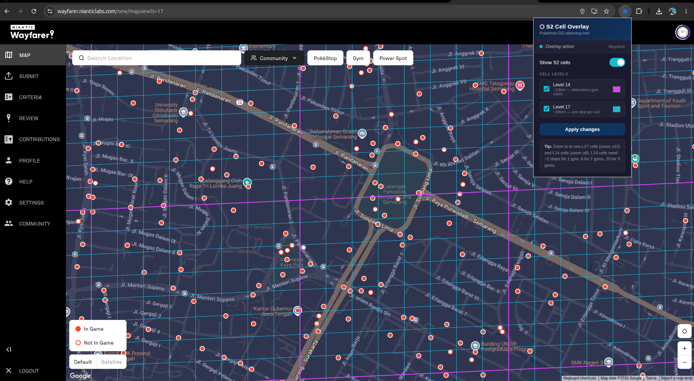

# S2 Cell Overlay for Wayfarer

A browser extension that overlays **S2 cells (Level 14 & Level 17)** directly on the [Niantic Wayfarer](https://wayfarer.nianticlabs.com/new/mapview) map.

## What are S2 cells?

Niantic uses Google's S2 geometry library to divide the Earth into a hierarchical grid. For Pokémon GO:

- **Level 14** (~10 km²) — determines how many Gyms a zone gets (2 stops = 1 gym, 6 = 2 gyms, 20 = 3 gyms)
- **Level 17** (~300 m²) — only one Pokéstop or Gym can exist per cell

Knowing these boundaries helps you plan Wayfarer nominations strategically.

## Features

- Overlay L14 and L17 cells directly on the Wayfarer map
- Cells update as you pan and zoom
- Customisable colours for each level
- Toggle on/off from the extension popup
- Persists your settings between sessions

## Installation

This extension is not on the Chrome Web Store. Install it manually:

1. Download the latest zip from [Releases](../../releases) and unzip it
2. Open Chrome and go to `chrome://extensions`
3. Enable **Developer mode** (top right toggle)
4. Click **Load unpacked** and select the unzipped `s2-extension` folder
5. Navigate to `https://wayfarer.nianticlabs.com/new/mapview`
6. Click the extension icon and toggle **Show S2 cells**

## Usage

- Open the extension popup on the Wayfarer mapview
- Toggle **Show S2 cells** on
- L14 cells appear at zoom level 8+, L17 cells at zoom level 12+
- Use the colour pickers to customise each level
- Click **Apply changes** after adjusting colours

## How it works

The extension injects a bridge script into the Wayfarer page that reads the embedded Google Maps instance from Angular's component context, then relays the current map bounds to a content script that draws an SVG overlay. All S2 cell geometry is computed locally using a pure JavaScript implementation — no external requests are made.

## Compatibility

- Chrome / Chromium-based browsers (Edge, Brave, etc.)
- Manifest V3
- Tested on `wayfarer.nianticlabs.com/new/mapview`

## Privacy & Security

The extension requests only `activeTab` and `storage` permissions. It reads no personal data, makes no network requests of any kind, and stores only your display preferences (colours, toggle state) locally on your device. All S2 geometry is computed entirely in the browser.

## Disclaimer

This is a **read-only, passive visual overlay**. It does not interact with Niantic's servers, does not automate any actions, and does not modify any game or review data. Use at your own discretion and in accordance with Wayfarer's Terms of Service.

## License

MIT — see [LICENSE](LICENSE)
